# Credit Card - Single Payment
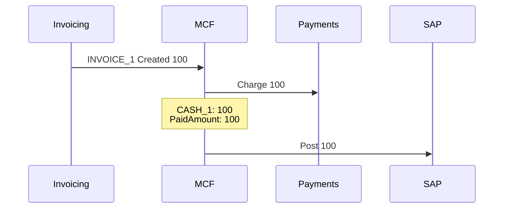
```mermaid
%%{init: {'theme': 'default'} }%%
sequenceDiagram
    participant Invoicing
    participant MCF
    participant Payments
    participant SAP
    Invoicing->>MCF: INVOICE_1 Created 100
    MCF->>Payments: Charge 100
    Note over MCF: CASH_1: 100<br/>PaidAmount: 100
    MCF->>SAP: Post 100   
```

# Check/Wire - Single Payment
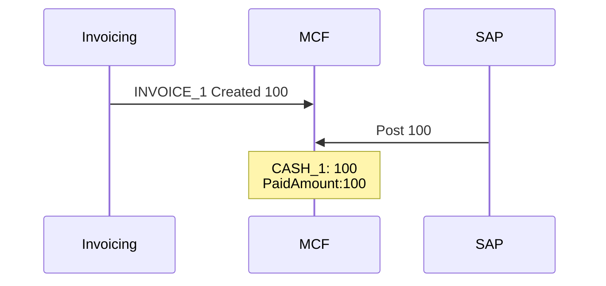
```mermaid
%%{init: {'theme': 'default'} }%%
sequenceDiagram
    participant Invoicing
    participant MCF
    participant SAP
    Invoicing->>MCF: INVOICE_1 Created 100    
    SAP->>MCF: Post 100
    Note over MCF: CASH_1: 100<br/>PaidAmount:100
```

 
 
 

# Check/Wire - Multiple Payments (Current)
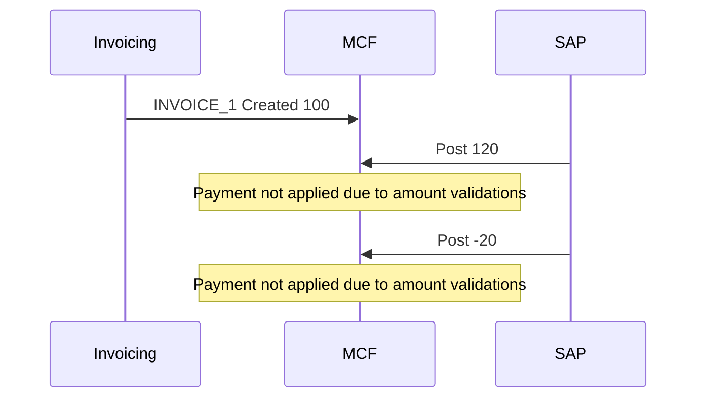
```mermaid
%%{init: {'theme': 'default'} }%%
sequenceDiagram
    participant Invoicing
    participant MCF
    participant SAP
    Invoicing->>MCF: INVOICE_1 Created 100
    SAP->>MCF: Post 120
    Note over MCF: Payment not applied due to amount validations
    SAP->>MCF: Post -20
    Note over MCF: Payment not applied due to amount validations
```
 
 
 

# Check/Wire - Multiple Payments (Phase 2 Changes)
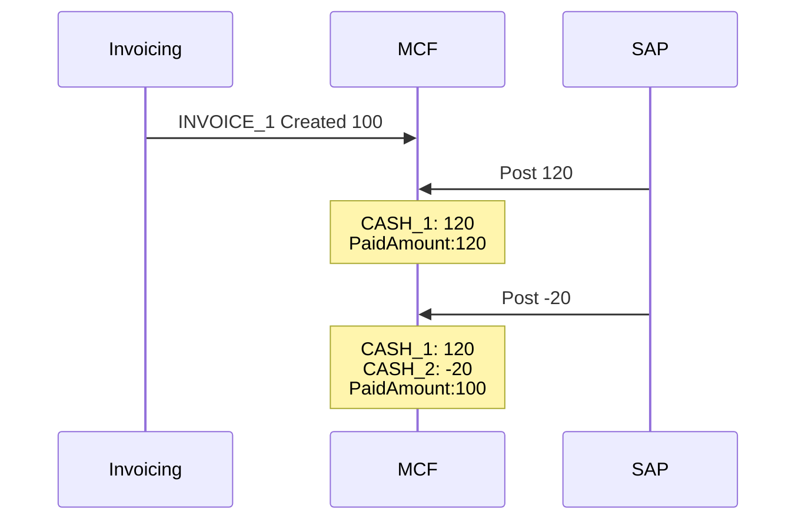
```mermaid
%%{init: {'theme': 'default'} }%%
sequenceDiagram
    participant Invoicing
    participant MCF
    participant SAP
    Invoicing->>MCF: INVOICE_1 Created 100
    SAP->>MCF: Post 120
    Note over MCF: CASH_1: 120<br/>PaidAmount:120
    SAP->>MCF: Post -20
    Note over MCF: CASH_1: 120<br/>CASH_2: -20<br/>PaidAmount:100
```
 
 
 

# Credit Card - Rebill of Unpaid invoice
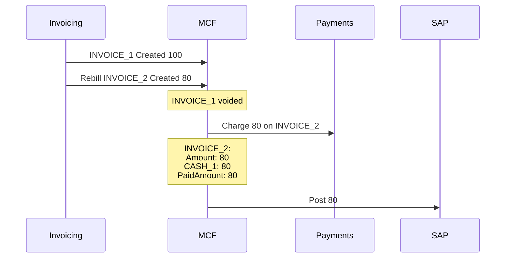
```mermaid
%%{init: {'theme': 'default'} }%%
sequenceDiagram
    participant Invoicing
    participant MCF
    participant Payments
    participant SAP
    Invoicing->>MCF: INVOICE_1 Created 100
    Invoicing->>MCF: Rebill INVOICE_2 Created 80
    Note over MCF: INVOICE_1 voided
    MCF->>Payments: Charge 80 on INVOICE_2
    Note over MCF: INVOICE_2:<br/>Amount: 80<br/>CASH_1: 80<br/>PaidAmount: 80
    MCF->>SAP: Post 80
```

 
 
 

# Credit Card - Rebill of Paid Invoice - Same Amount (Current)
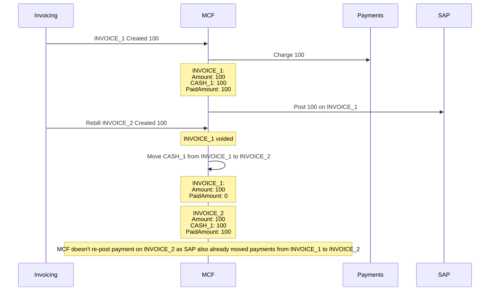
```mermaid
%%{init: {'theme': 'default'} }%%
sequenceDiagram
    participant Invoicing
    participant MCF
    participant Payments
    participant SAP
    Invoicing->>MCF: INVOICE_1 Created 100
    MCF->>Payments: Charge 100
    Note over MCF: INVOICE_1:<br/>Amount: 100<br/>CASH_1: 100<br/>PaidAmount: 100
    MCF->>SAP: Post 100 on INVOICE_1
    Invoicing->>MCF: Rebill INVOICE_2 Created 100
    Note over MCF: INVOICE_1 voided
    MCF->>MCF: Move CASH_1 from INVOICE_1 to INVOICE_2
    Note over MCF: INVOICE_1:<br/>Amount: 100<br/>PaidAmount: 0
    Note over MCF: INVOICE_2<br/>Amount: 100<br/>CASH_1: 100<br/>PaidAmount: 100
    Note over MCF: MCF doesn't re-post payment on INVOICE_2 as SAP also already moved payments from INVOICE_1 to INVOICE_2
```

 
 
 

# Credit Card - Rebill of Paid Invoice - Same Amount (Phase 3 Changes)
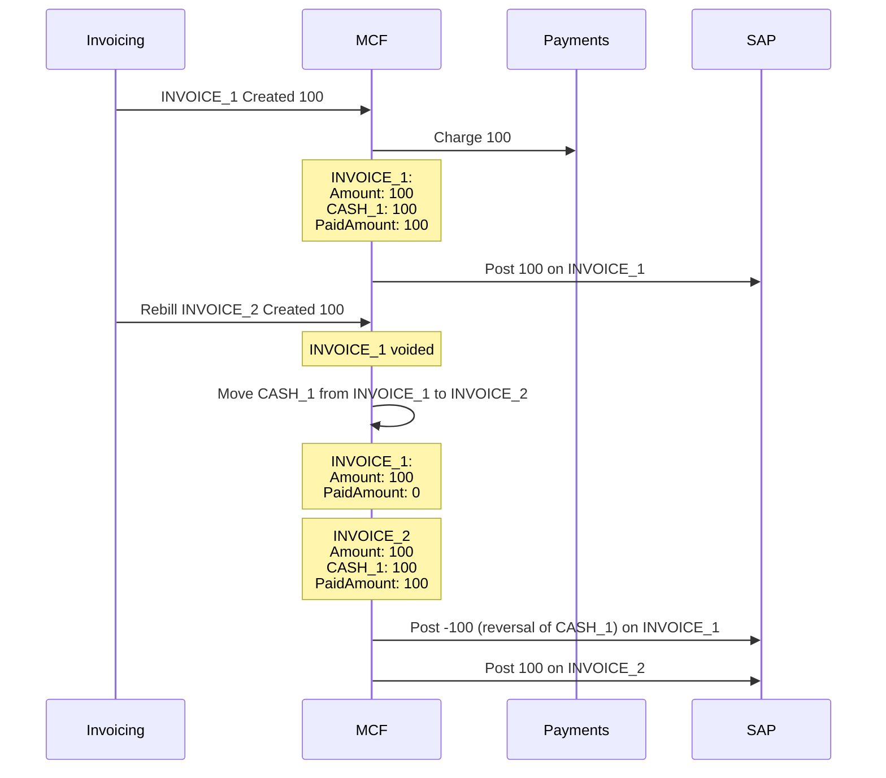
```mermaid
%%{init: {'theme': 'default'} }%%
sequenceDiagram
    participant Invoicing
    participant MCF
    participant Payments
    participant SAP
    Invoicing->>MCF: INVOICE_1 Created 100
    MCF->>Payments: Charge 100
    Note over MCF: INVOICE_1:<br/>Amount: 100<br/>CASH_1: 100<br/>PaidAmount: 100
    MCF->>SAP: Post 100 on INVOICE_1
    Invoicing->>MCF: Rebill INVOICE_2 Created 100
    Note over MCF: INVOICE_1 voided
    MCF->>MCF: Move CASH_1 from INVOICE_1 to INVOICE_2
    Note over MCF: INVOICE_1:<br/>Amount: 100<br/>PaidAmount: 0
    Note over MCF: INVOICE_2<br/>Amount: 100<br/>CASH_1: 100<br/>PaidAmount: 100
    MCF->>SAP: Post -100 (reversal of CASH_1) on INVOICE_1
    MCF->>SAP: Post 100 on INVOICE_2

```

 
 
 

# Credit Card - Rebill of Paid Invoice - Lower Amount (Current)
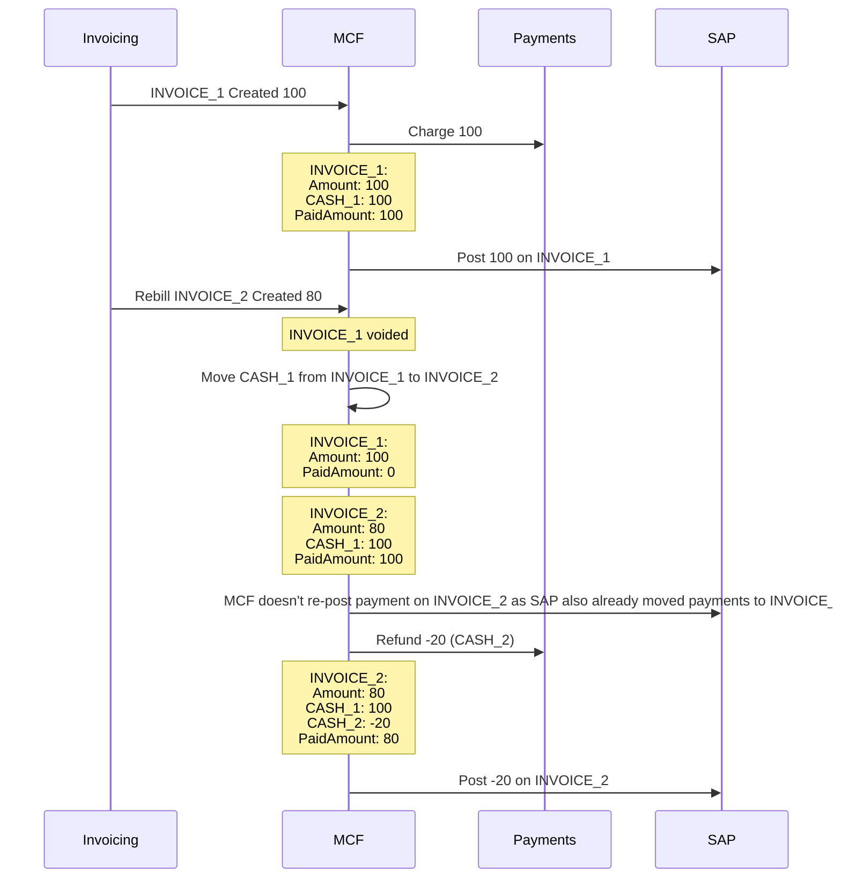
```mermaid
%%{init: {'theme': 'default'} }%%
sequenceDiagram
    participant Invoicing
    participant MCF
    participant Payments
    participant SAP
    Invoicing->>MCF: INVOICE_1 Created 100
    MCF->>Payments: Charge 100
    Note over MCF: INVOICE_1:<br/>Amount: 100<br/>CASH_1: 100<br/>PaidAmount: 100
    MCF->>SAP: Post 100 on INVOICE_1
    Invoicing->>MCF: Rebill INVOICE_2 Created 80
    Note over MCF: INVOICE_1 voided
    MCF->>MCF: Move CASH_1 from INVOICE_1 to INVOICE_2
    Note over MCF: INVOICE_1:<br/>Amount: 100<br/>PaidAmount: 0
    Note over MCF: INVOICE_2:<br/>Amount: 80<br/>CASH_1: 100<br/>PaidAmount: 100
    MCF->>SAP: MCF doesn't re-post payment on INVOICE_2 as SAP also already moved payments to INVOICE_2
    MCF->>Payments: Refund -20 (CASH_2)
    Note over MCF: INVOICE_2:<br/>Amount: 80<br/>CASH_1: 100<br/>CASH_2: -20<br/>PaidAmount: 80
    MCF->>SAP: Post -20 on INVOICE_2
```

 
 
 

# Credit Card - Rebill of Paid Invoice - Lower Amount (Phase 3 Changes)
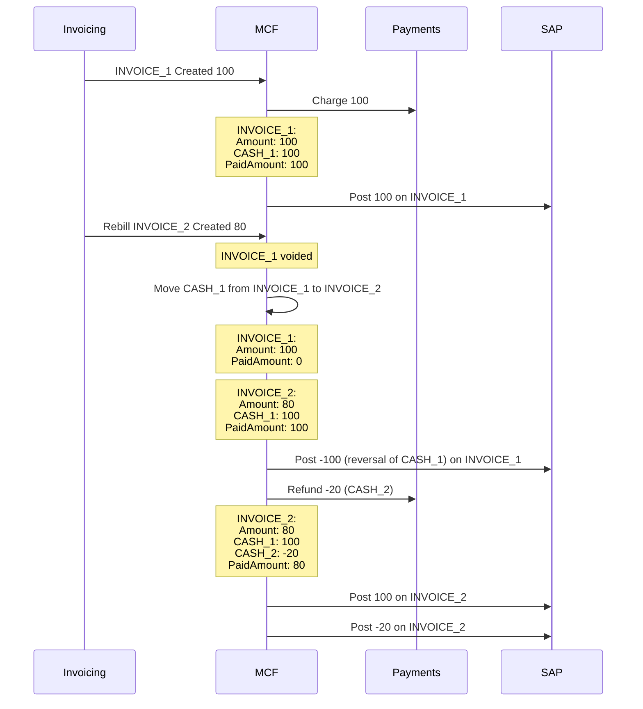
```mermaid
%%{init: {'theme': 'default'} }%%
sequenceDiagram
    participant Invoicing
    participant MCF
    participant Payments
    participant SAP
    Invoicing->>MCF: INVOICE_1 Created 100
    MCF->>Payments: Charge 100
    Note over MCF: INVOICE_1:<br/>Amount: 100<br/>CASH_1: 100<br/>PaidAmount: 100
    MCF->>SAP: Post 100 on INVOICE_1
    Invoicing->>MCF: Rebill INVOICE_2 Created 80
    Note over MCF: INVOICE_1 voided
    MCF->>MCF: Move CASH_1 from INVOICE_1 to INVOICE_2
    Note over MCF: INVOICE_1:<br/>Amount: 100<br/>PaidAmount: 0
    Note over MCF: INVOICE_2:<br/>Amount: 80<br/>CASH_1: 100<br/>PaidAmount: 100
    MCF->>SAP: Post -100 (reversal of CASH_1) on INVOICE_1
    MCF->>Payments: Refund -20 (CASH_2)
    Note over MCF: INVOICE_2:<br/>Amount: 80<br/>CASH_1: 100<br/>CASH_2: -20<br/>PaidAmount: 80
    MCF->>SAP: Post 100 on INVOICE_2
    MCF->>SAP: Post -20 on INVOICE_2

```

 
 
 

# Check/Wire - Rebill of Unpaid invoice
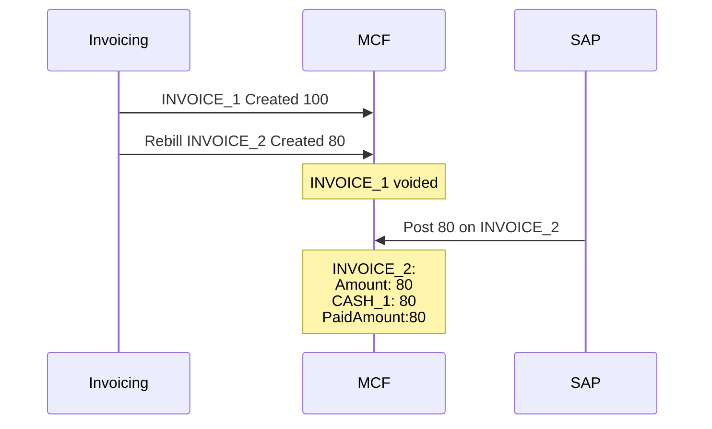
```mermaid
%%{init: {'theme': 'default'} }%%
sequenceDiagram
    participant Invoicing
    participant MCF
    participant SAP
    Invoicing->>MCF: INVOICE_1 Created 100    
    Invoicing->>MCF: Rebill INVOICE_2 Created 80
    Note over MCF: INVOICE_1 voided
    SAP->>MCF: Post 80 on INVOICE_2
    Note over MCF: INVOICE_2:<br/>Amount: 80<br/>CASH_1: 80<br/>PaidAmount:80
```

 
 
 

# Check/Wire - Rebill of Paid Invoice - Same Amount (Current)
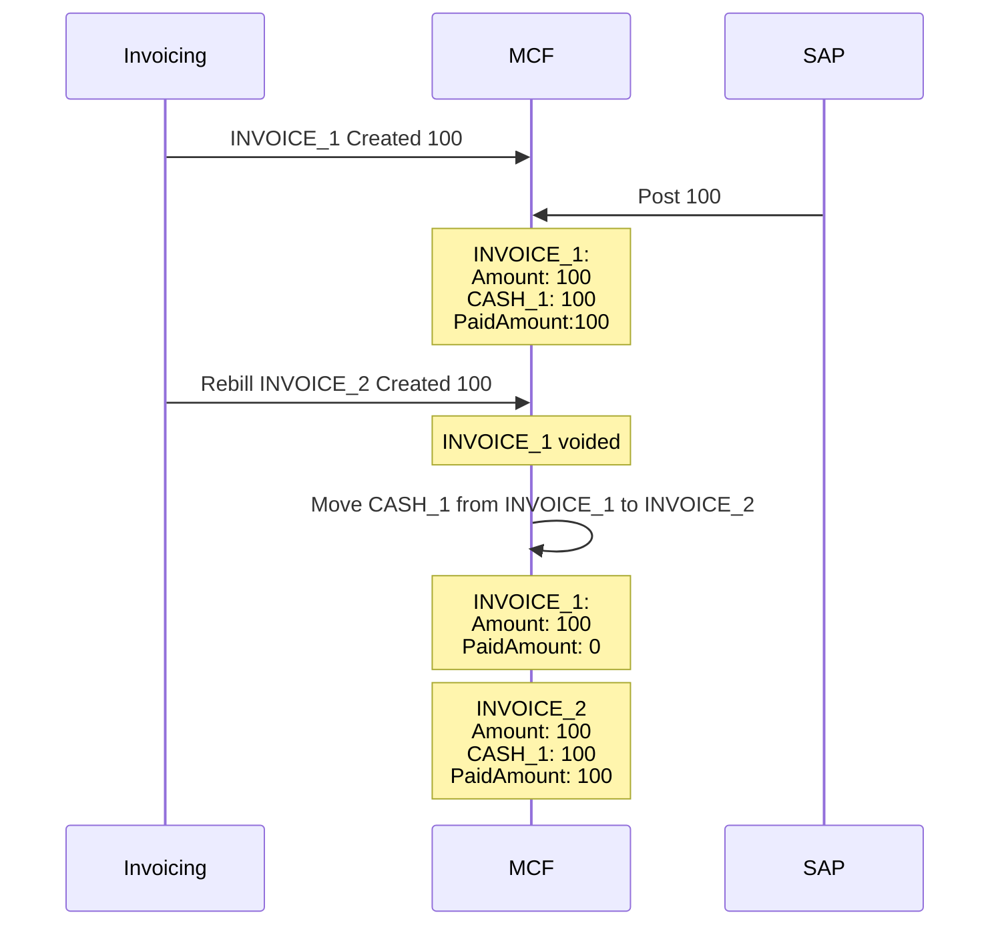
```mermaid
%%{init: {'theme': 'default'} }%%
sequenceDiagram
    participant Invoicing
    participant MCF
    participant SAP
    Invoicing->>MCF: INVOICE_1 Created 100    
    SAP->>MCF: Post 100
    Note over MCF: INVOICE_1:<br/>Amount: 100<br/>CASH_1: 100<br/>PaidAmount:100
    Invoicing->>MCF: Rebill INVOICE_2 Created 100
    Note over MCF: INVOICE_1 voided
    MCF->>MCF: Move CASH_1 from INVOICE_1 to INVOICE_2
    Note over MCF: INVOICE_1:<br/>Amount: 100<br/>PaidAmount: 0
    Note over MCF: INVOICE_2<br/>Amount: 100<br/>CASH_1: 100<br/>PaidAmount: 100
```

 
 
 

# Check/Wire - Rebill of Paid Invoice - Same Amount (Phase 2 Changes)
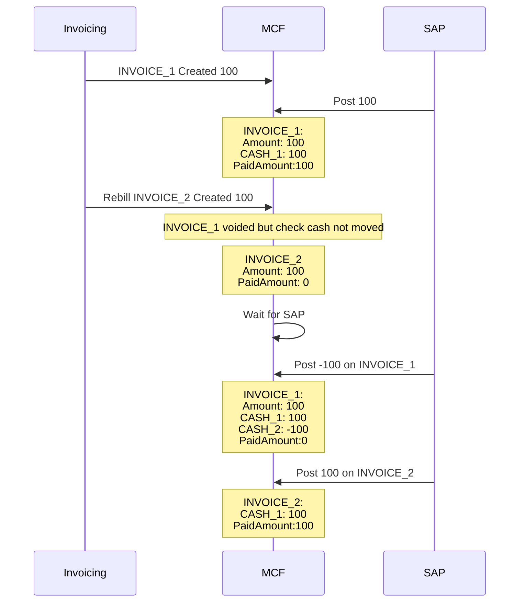
```mermaid
%%{init: {'theme': 'default'} }%%
sequenceDiagram
    participant Invoicing
    participant MCF
    participant SAP
    Invoicing->>MCF: INVOICE_1 Created 100    
    SAP->>MCF: Post 100
    Note over MCF: INVOICE_1:<br/>Amount: 100<br/>CASH_1: 100<br/>PaidAmount:100
    Invoicing->>MCF: Rebill INVOICE_2 Created 100
    Note over MCF: INVOICE_1 voided but check cash not moved
    Note over MCF: INVOICE_2<br/>Amount: 100<br/>PaidAmount: 0
    MCF->>MCF: Wait for SAP
    SAP->>MCF: Post -100 on INVOICE_1
    Note over MCF: INVOICE_1:<br/>Amount: 100<br/>CASH_1: 100<br/>CASH_2: -100<br/>PaidAmount:0
    SAP->>MCF: Post 100 on INVOICE_2
    Note over MCF: INVOICE_2:<br/>CASH_1: 100<br/>PaidAmount:100
```

 
 
 

# Check/Wire - Rebill of Paid Invoice - Lower Amount (Current)
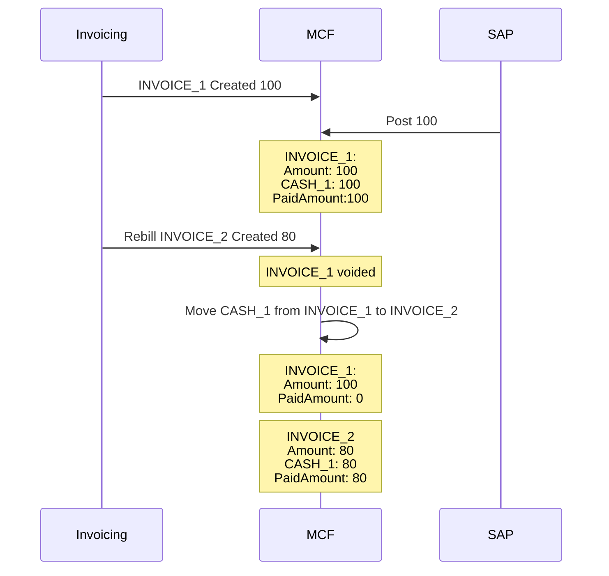
```mermaid
%%{init: {'theme': 'default'} }%%
sequenceDiagram
    participant Invoicing
    participant MCF
    participant SAP
    Invoicing->>MCF: INVOICE_1 Created 100    
    SAP->>MCF: Post 100
    Note over MCF: INVOICE_1:<br/>Amount: 100<br/>CASH_1: 100<br/>PaidAmount:100
    Invoicing->>MCF: Rebill INVOICE_2 Created 80
    Note over MCF: INVOICE_1 voided
    MCF->>MCF: Move CASH_1 from INVOICE_1 to INVOICE_2
    Note over MCF: INVOICE_1:<br/>Amount: 100<br/>PaidAmount: 0
    Note over MCF: INVOICE_2<br/>Amount: 80<br/>CASH_1: 80<br/>PaidAmount: 80
```

 
 
 

# Check/Wire - Rebill of Paid Invoice - Lower Amount (Phase 2 Changes)
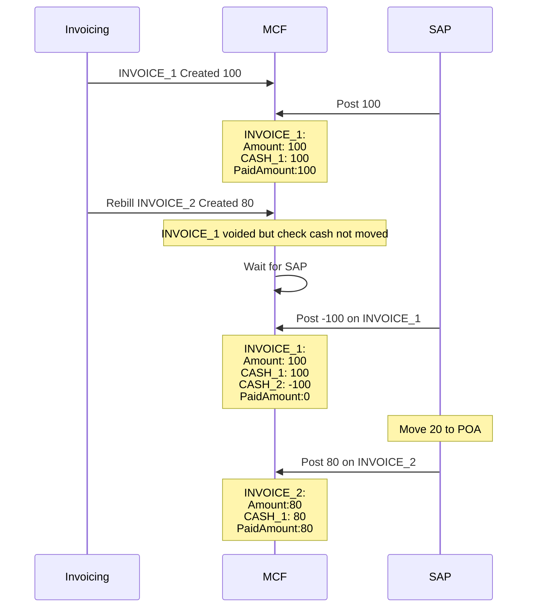
```mermaid
%%{init: {'theme': 'default'} }%%
sequenceDiagram
    participant Invoicing
    participant MCF
    participant SAP
    Invoicing->>MCF: INVOICE_1 Created 100    
    SAP->>MCF: Post 100
    Note over MCF: INVOICE_1:<br/>Amount: 100<br/>CASH_1: 100<br/>PaidAmount:100
    Invoicing->>MCF: Rebill INVOICE_2 Created 80
    Note over MCF: INVOICE_1 voided but check cash not moved
    MCF->>MCF: Wait for SAP
    SAP->>MCF: Post -100 on INVOICE_1
    Note over MCF: INVOICE_1:<br/>Amount: 100<br/>CASH_1: 100<br/>CASH_2: -100<br/>PaidAmount:0
    Note over SAP: Move 20 to POA
    SAP->>MCF: Post 80 on INVOICE_2
    Note over MCF: INVOICE_2:<br/>Amount:80<br/>CASH_1: 80<br/>PaidAmount:80
```

 
 
 

# CC customer - Check payment received after invoice already paid using credit card (Current)
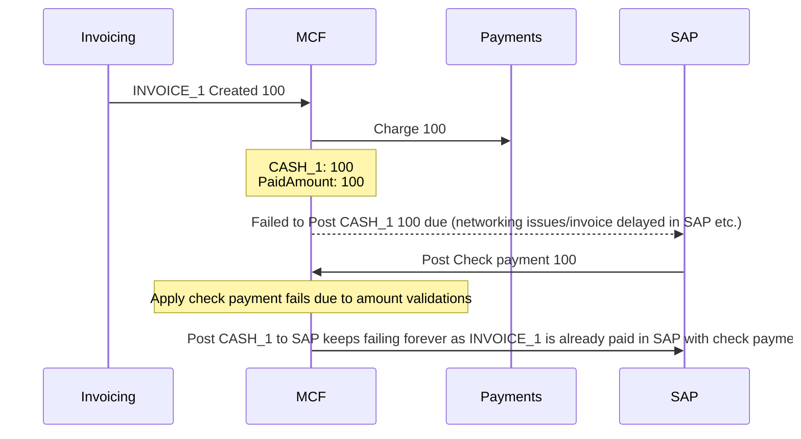
```mermaid
%%{init: {'theme': 'default'} }%%
sequenceDiagram
    participant Invoicing
    participant MCF
    participant Payments
    participant SAP
    Invoicing->>MCF: INVOICE_1 Created 100
    MCF->>Payments: Charge 100
    Note over MCF: CASH_1: 100<br/>PaidAmount: 100
    MCF-->>SAP: Failed to Post CASH_1 100 due (networking issues/invoice delayed in SAP etc.)
    SAP->>MCF: Post Check payment 100
    Note over MCF: Apply check payment fails due to amount validations   
    MCF->>SAP: Post CASH_1 to SAP keeps failing forever as INVOICE_1 is already paid in SAP with check payment
```
 
 
 

# CC customer - Check payment received after invoice already paid using credit card (Phase 2 Changes)
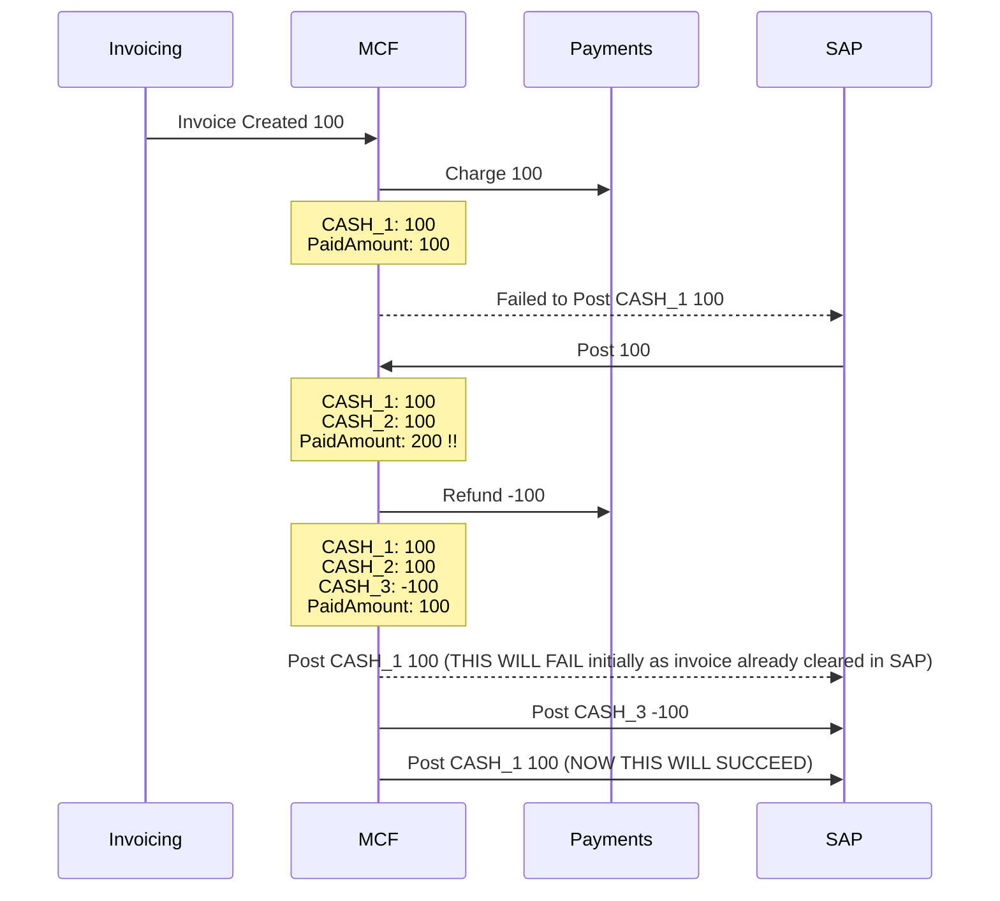
```mermaid
%%{init: {'theme': 'default'} }%%
sequenceDiagram
    participant Invoicing
    participant MCF
    participant Payments
    participant SAP
    Invoicing->>MCF: Invoice Created 100
    MCF->>Payments: Charge 100
    Note over MCF: CASH_1: 100<br/>PaidAmount: 100
    MCF-->>SAP: Failed to Post CASH_1 100
    SAP->>MCF: Post 100
    Note over MCF: CASH_1: 100<br/>CASH_2: 100<br/>PaidAmount: 200 !!
    MCF->>Payments: Refund -100
    Note over MCF: CASH_1: 100<br/>CASH_2: 100<br/>CASH_3: -100<br/>PaidAmount: 100
    MCF-->>SAP: Post CASH_1 100 (THIS WILL FAIL initially as invoice already cleared in SAP)
    MCF->>SAP: Post CASH_3 -100
    MCF->>SAP: Post CASH_1 100 (NOW THIS WILL SUCCEED)
```
 
 
 

# Rebill of invoice which had both credit card and check payments (Current)
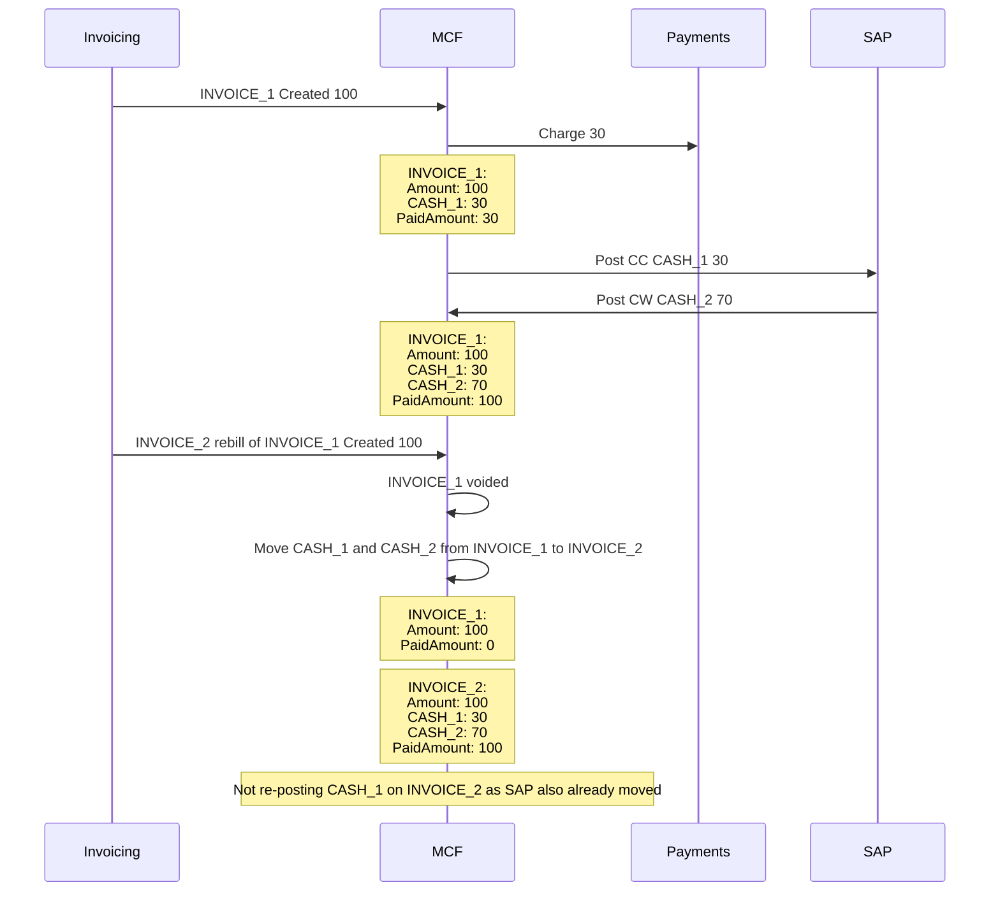
```mermaid
%%{init: {'theme': 'default'} }%%
sequenceDiagram
    participant Invoicing
    participant MCF
    participant Payments
    participant SAP
    Invoicing->>MCF: INVOICE_1 Created 100
    MCF->>Payments: Charge 30
    Note over MCF: INVOICE_1:<br/>Amount: 100<br/>CASH_1: 30<br/>PaidAmount: 30
    MCF->>SAP: Post CC CASH_1 30
    SAP->>MCF: Post CW CASH_2 70
    Note over MCF: INVOICE_1:<br/>Amount: 100<br/>CASH_1: 30<br/>CASH_2: 70<br/>PaidAmount: 100
    Invoicing->>MCF: INVOICE_2 rebill of INVOICE_1 Created 100
    MCF->>MCF: INVOICE_1 voided
    MCF->>MCF: Move CASH_1 and CASH_2 from INVOICE_1 to INVOICE_2
    Note over MCF: INVOICE_1:<br/>Amount: 100<br/>PaidAmount: 0
    Note over MCF: INVOICE_2:<br/>Amount: 100<br/>CASH_1: 30<br/>CASH_2: 70<br/>PaidAmount: 100
    Note over MCF: Not re-posting CASH_1 on INVOICE_2 as SAP also already moved
```
 
 
 

# Rebill of invoice which had both credit card and check payments (Phase 2 Changes)
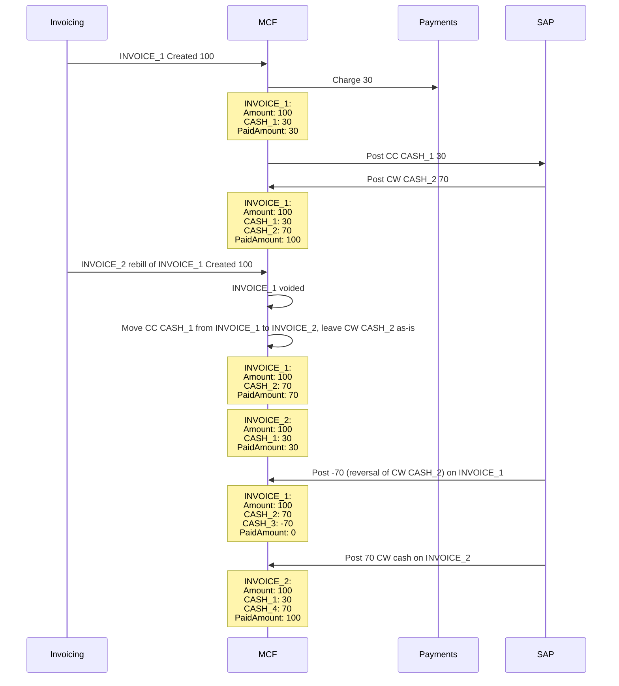
```mermaid
%%{init: {'theme': 'default'} }%%
sequenceDiagram
    participant Invoicing
    participant MCF
    participant Payments
    participant SAP
    Invoicing->>MCF: INVOICE_1 Created 100
    MCF->>Payments: Charge 30
    Note over MCF: INVOICE_1:<br/>Amount: 100<br/>CASH_1: 30<br/>PaidAmount: 30
    MCF->>SAP: Post CC CASH_1 30
    SAP->>MCF: Post CW CASH_2 70
    Note over MCF: INVOICE_1:<br/>Amount: 100<br/>CASH_1: 30<br/>CASH_2: 70<br/>PaidAmount: 100
    Invoicing->>MCF: INVOICE_2 rebill of INVOICE_1 Created 100
    MCF->>MCF: INVOICE_1 voided
    MCF->>MCF: Move CC CASH_1 from INVOICE_1 to INVOICE_2, leave CW CASH_2 as-is
    Note over MCF: INVOICE_1:<br/>Amount: 100<br/>CASH_2: 70<br/>PaidAmount: 70
    Note over MCF: INVOICE_2:<br/>Amount: 100<br/>CASH_1: 30<br/>PaidAmount: 30
    SAP->>MCF: Post -70 (reversal of CW CASH_2) on INVOICE_1
    Note over MCF: INVOICE_1:<br/>Amount: 100<br/>CASH_2: 70<br/>CASH_3: -70<br/>PaidAmount: 0
    SAP->>MCF: Post 70 CW cash on INVOICE_2
    Note over MCF: INVOICE_2:<br/>Amount: 100<br/>CASH_1: 30<br/>CASH_4: 70<br/>PaidAmount: 100
```
 
 
 

# Rebill of invoice which had both credit card and check payments (Phase 3 Changes)
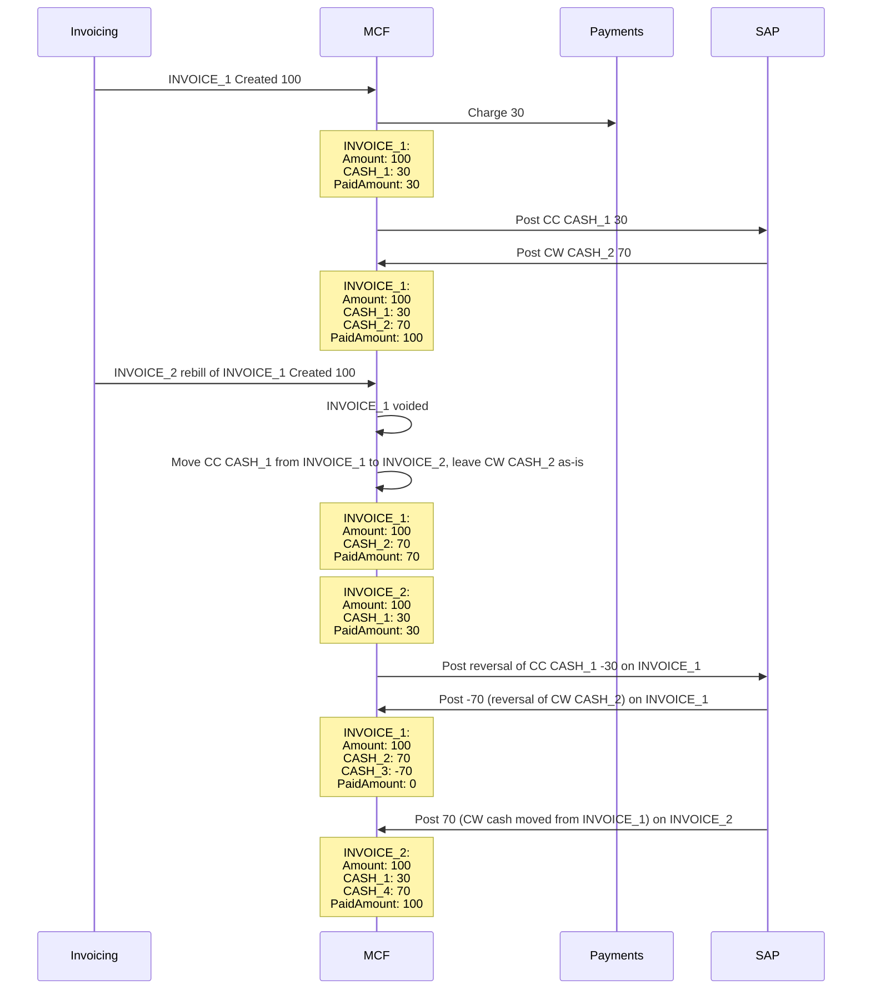
```mermaid
%%{init: {'theme': 'default'} }%%
sequenceDiagram
    participant Invoicing
    participant MCF
    participant Payments
    participant SAP
    Invoicing->>MCF: INVOICE_1 Created 100
    MCF->>Payments: Charge 30
    Note over MCF: INVOICE_1:<br/>Amount: 100<br/>CASH_1: 30<br/>PaidAmount: 30
    MCF->>SAP: Post CC CASH_1 30
    SAP->>MCF: Post CW CASH_2 70
    Note over MCF: INVOICE_1:<br/>Amount: 100<br/>CASH_1: 30<br/>CASH_2: 70<br/>PaidAmount: 100
    Invoicing->>MCF: INVOICE_2 rebill of INVOICE_1 Created 100
    MCF->>MCF: INVOICE_1 voided
    MCF->>MCF: Move CC CASH_1 from INVOICE_1 to INVOICE_2, leave CW CASH_2 as-is
    Note over MCF: INVOICE_1:<br/>Amount: 100<br/>CASH_2: 70<br/>PaidAmount: 70
    Note over MCF: INVOICE_2:<br/>Amount: 100<br/>CASH_1: 30<br/>PaidAmount: 30
    MCF->>SAP: Post reversal of CC CASH_1 -30 on INVOICE_1
    SAP->>MCF: Post -70 (reversal of CW CASH_2) on INVOICE_1
    Note over MCF: INVOICE_1:<br/>Amount: 100<br/>CASH_2: 70<br/>CASH_3: -70<br/>PaidAmount: 0
    SAP->>MCF: Post 70 (CW cash moved from INVOICE_1) on INVOICE_2
    Note over MCF: INVOICE_2:<br/>Amount: 100<br/>CASH_1: 30<br/>CASH_4: 70<br/>PaidAmount: 100
```
 
 
 

# Rebill of invoice which had both credit card and check payments - Partial Payment - Credit Card customer
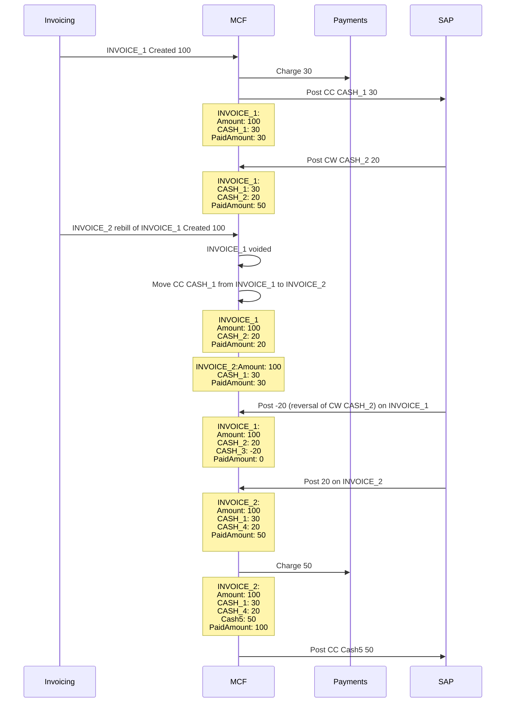
```mermaid
%%{init: {'theme': 'default'} }%%
sequenceDiagram
    participant Invoicing
    participant MCF
    participant Payments
    participant SAP
    Invoicing->>MCF: INVOICE_1 Created 100
    MCF->>Payments: Charge 30
    MCF->>SAP: Post CC CASH_1 30
    Note over MCF: INVOICE_1:<br/>Amount: 100<br/>CASH_1: 30<br/>PaidAmount: 30
    SAP->>MCF: Post CW CASH_2 20
    Note over MCF: INVOICE_1:<br/>CASH_1: 30<br/>CASH_2: 20<br/>PaidAmount: 50
    Invoicing->>MCF: INVOICE_2 rebill of INVOICE_1 Created 100
    MCF->>MCF: INVOICE_1 voided
    MCF->>MCF: Move CC CASH_1 from INVOICE_1 to INVOICE_2
    Note over MCF: INVOICE_1<br/>Amount: 100<br/>CASH_2: 20<br/>PaidAmount: 20
    Note over MCF: INVOICE_2:Amount: 100<br/>CASH_1: 30<br/>PaidAmount: 30
    SAP->>MCF: Post -20 (reversal of CW CASH_2) on INVOICE_1
    Note over MCF: INVOICE_1:<br/>Amount: 100<br/>CASH_2: 20<br/>CASH_3: -20<br/>PaidAmount: 0
    SAP->>MCF: Post 20 on INVOICE_2
    Note over MCF: INVOICE_2:<br/>Amount: 100<br/>CASH_1: 30<br/>CASH_4: 20<br/>PaidAmount: 50<br/>
    MCF->>Payments: Charge 50
    Note over MCF: INVOICE_2:<br/>Amount: 100<br/>CASH_1: 30<br/>CASH_4: 20<br/>Cash5: 50<br/>PaidAmount: 100
    MCF->>SAP: Post CC Cash5 50
```
 
 
 

# Credit Card - Rebill of invoice with both credit card and check payments but check payments not yet posted to MCF - Credit Card Customer
```mermaid
%%{init: {'theme': 'default'} }%%
sequenceDiagram
    participant Invoicing
    participant MCF
    participant Payments
    participant SAP
    Invoicing->>MCF: INVOICE_1 Created 100
    MCF->>Payments: Charge 30
    Note over MCF: INVOICE_1:<br/>Amount: 100<br/>CASH_1: 30<br/>PaidAmount: 30
    MCF->>SAP: Post 30
    SAP->>SAP: Check payment for 70
    SAP-->>MCF: Failed to post check payment
    Note over MCF: INVOICE_1:<br/>CASH_1: 30<br/>PaidAmount: 30
    Invoicing->>MCF: INVOICE_2 rebill of INVOICE_1 Created 100
    MCF->>MCF: INVOICE_1 voided    
    MCF->>MCF: Move CC CASH_1 from INVOICE_1 to INVOICE_2
    Note over MCF: INVOICE_1:<br/>Amount: 100<br/>PaidAmount: 0
    Note over MCF: INVOICE_2:<br/>Amount: 100<br/>CASH_1: 30<br/>PaidAmount: 30<br/>
    MCF->>SAP: Post -30 (reversal of CC CASH_1) on INVOICE_1
    MCF->>SAP: Post 30 on INVOICE_2
    Note over MCF: In this case MCF won't wait for taking action on INVOICE_2 as it's not aware of CW Cash applied in SAP
    MCF->>Payments: Charge 70
    Note over MCF: INVOICE_2:<br/>Amount: 100<br/>CASH_1: 30<br/>CASH_2: 70<br/>PaidAmount: 100
    MCF->>SAP: Post 70 on INVOICE_2
    SAP->>MCF: Post 70 on INVOICE_1 (Eventually)
    SAP->>MCF: Post -70 on INVOICE_1
    Note over MCF: INVOICE_1:Amount: 100<br/>CASH_3: 70<br/>CASH_4: -70<br/>PaidAmount: 0
    SAP->>MCF: Post 70 on INVOICE_2
    Note over MCF: INVOICE_2:<br/>Amount: 100<br/>CASH_1: 30<br/>CASH_2: 70<br/>Cash5: 70<br/>PaidAmount: 170 !!
    MCF->>Payments: Refund -70
    Note over MCF: INVOICE_2:<br/>Amount:100<br/>CASH_1: 30<br/>CASH_2: 70<br/>Cash5: 70<br/>Cash6: -70<br/>PaidAmount: 100
    MCF->>SAP: Post -70
    
```
