# Credit Card - Single Payment
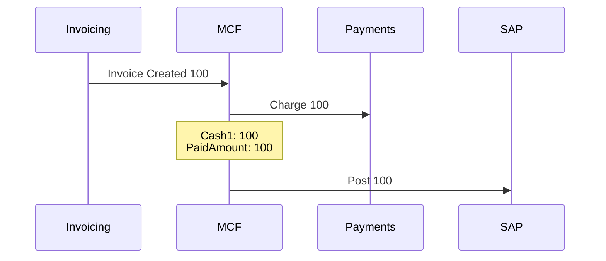
 
 
 

# Check/Wire - Single Payment
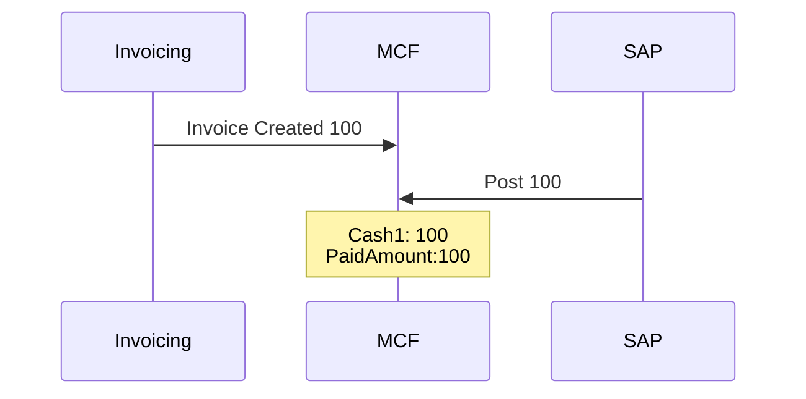

 
 
 
 
# Check/Wire - Multiple Payments
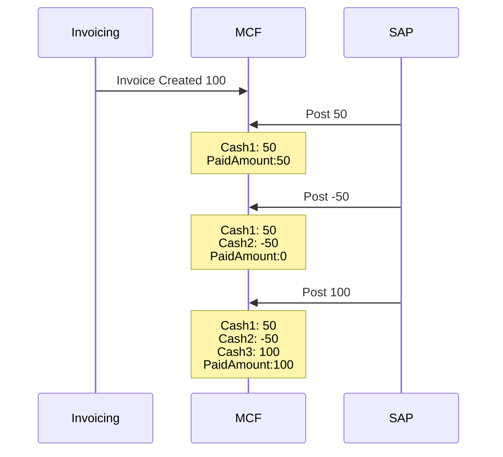
 
 
 

# Credit Card - Rebill of Unpaid invoice
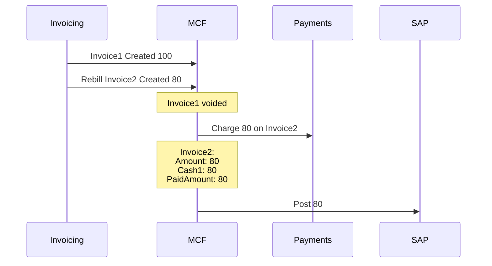

 
 
 

# Credit Card - Rebill of Paid Invoice - Same Amount
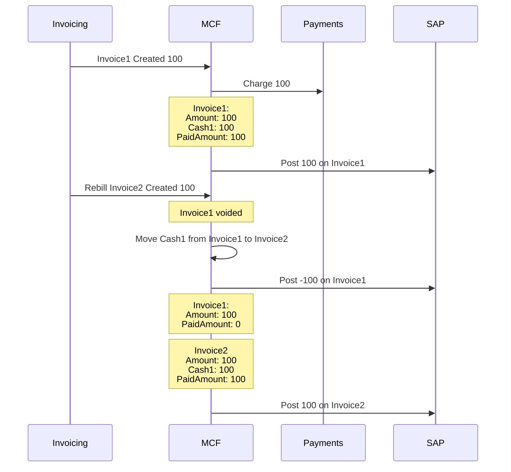

 
 
 

# Credit Card - Rebill of Paid Invoice - Lower Amount
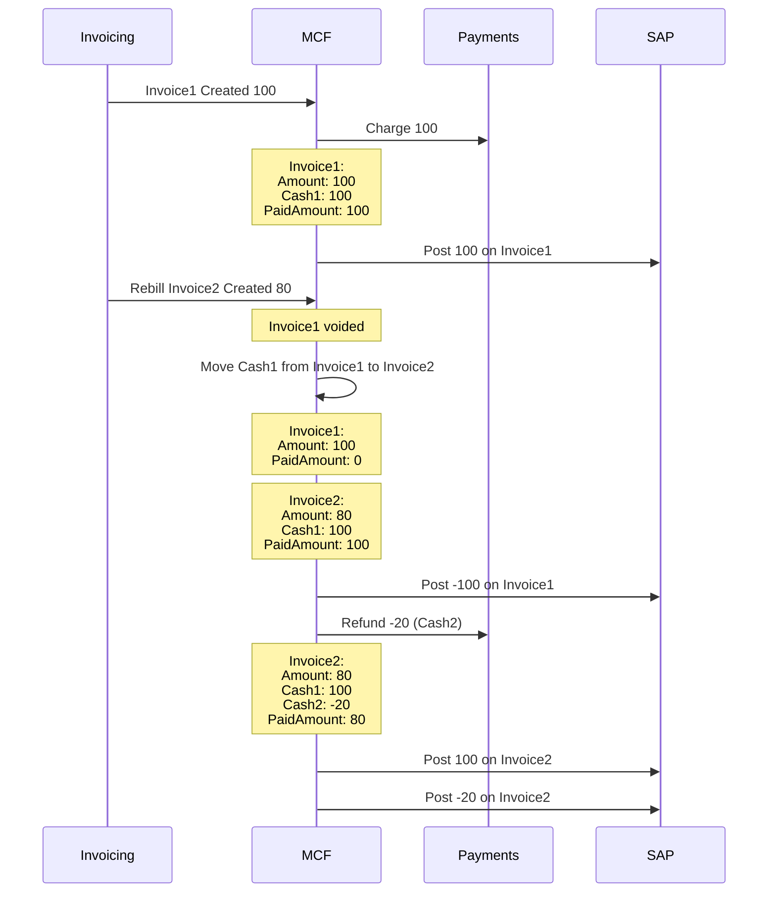

 
 
 

# Check/Wire - Rebill of Unpaid invoice
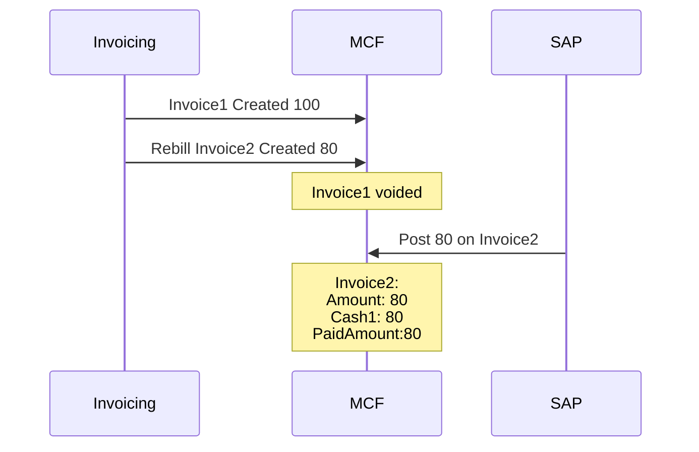

 
 
 

# Check/Wire - Rebill of Paid Invoice - Same Amount
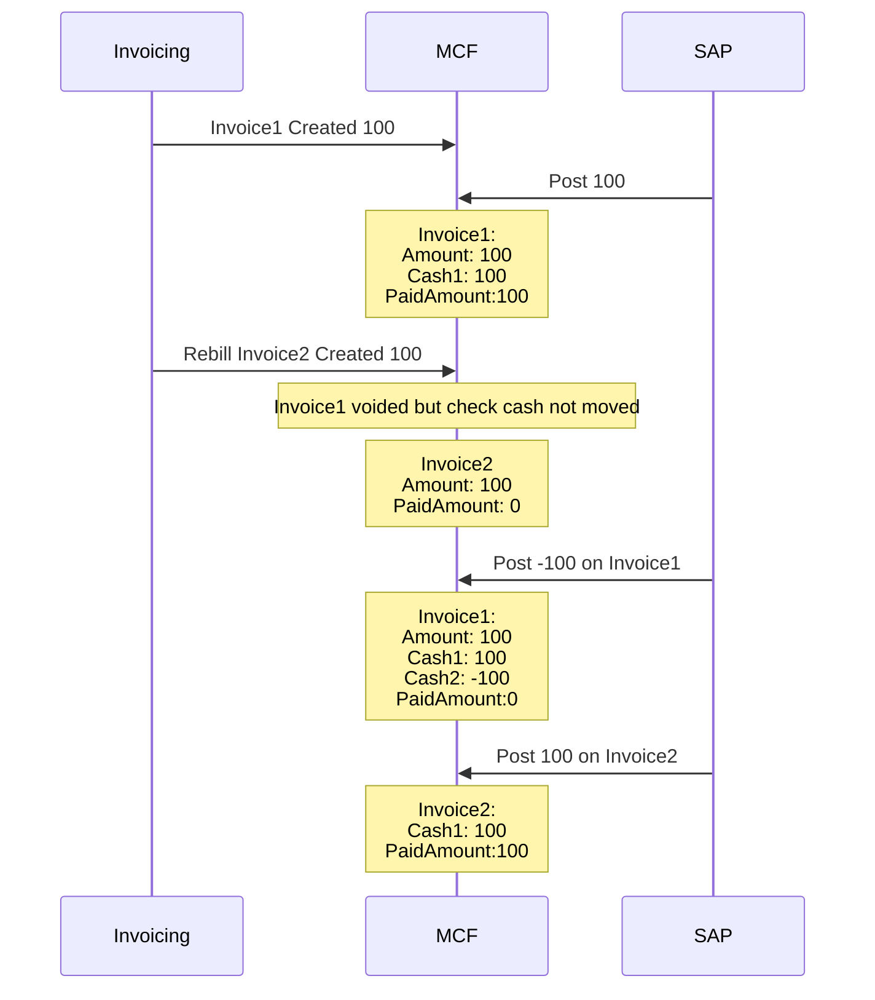

 
 
 

# Check/Wire - Rebill of Paid Invoice - Lower Amount
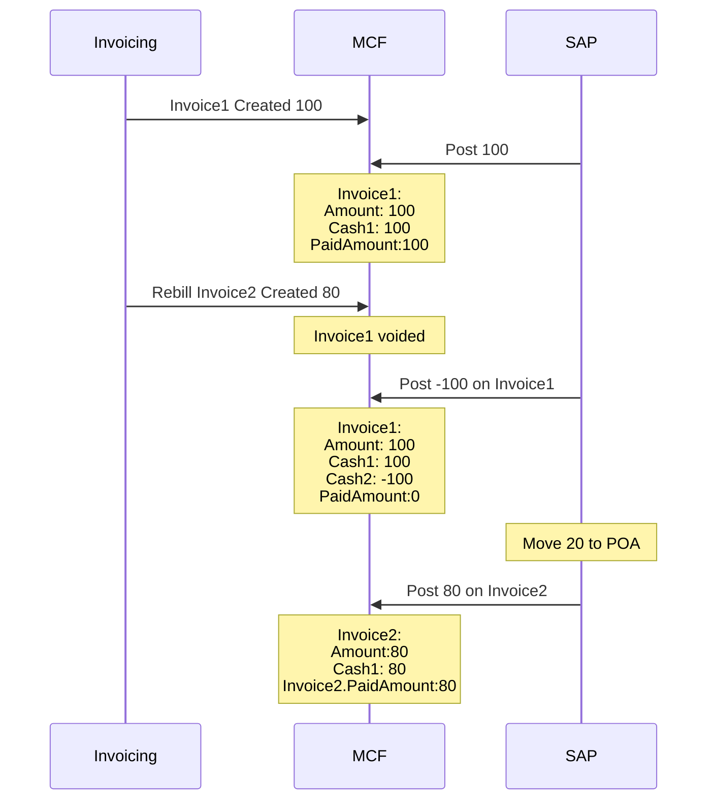

 
 
 

# Mixed - Check payment received after invoice already paid using credit card
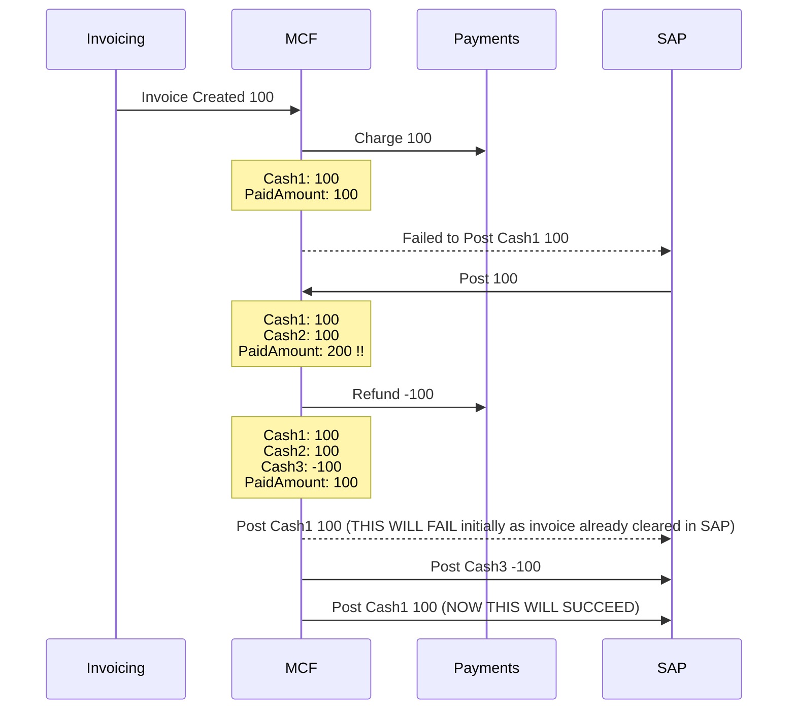
 
 
 

# Rebill of invoice which had both credit card and check payments
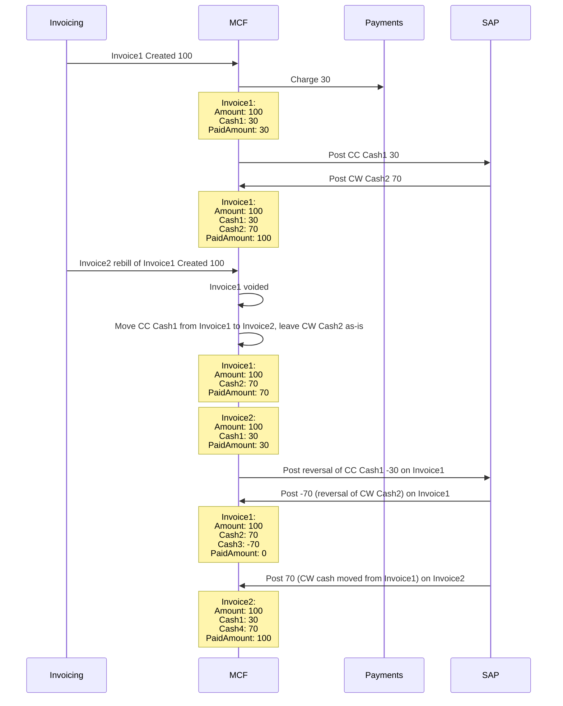
 
 
 

# Rebill of invoice which had both credit card and check payments - Partial Payment - Credit Card customer
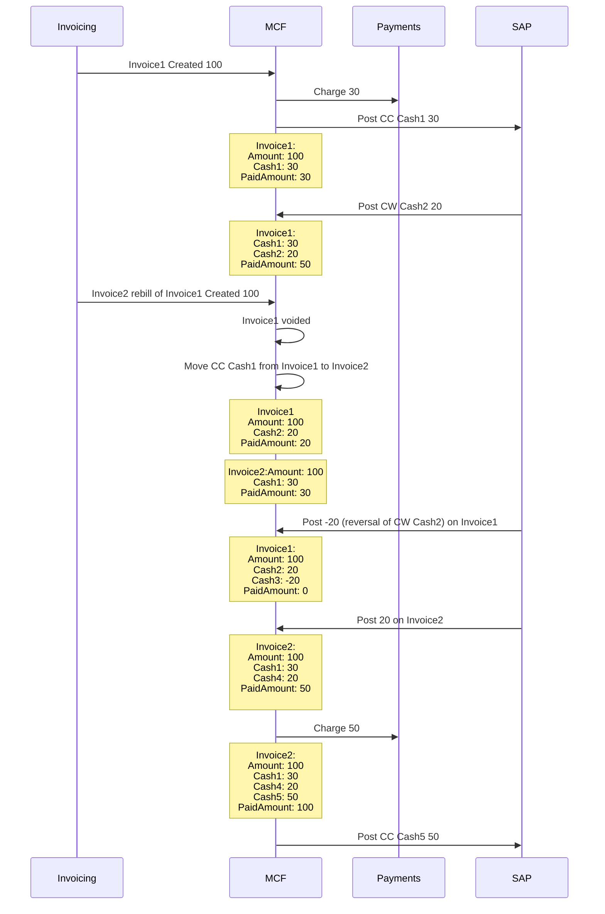
 
 
 

# Credit Card - Rebill of invoice with both credit card and check payments but check payments not yet posted to MCF
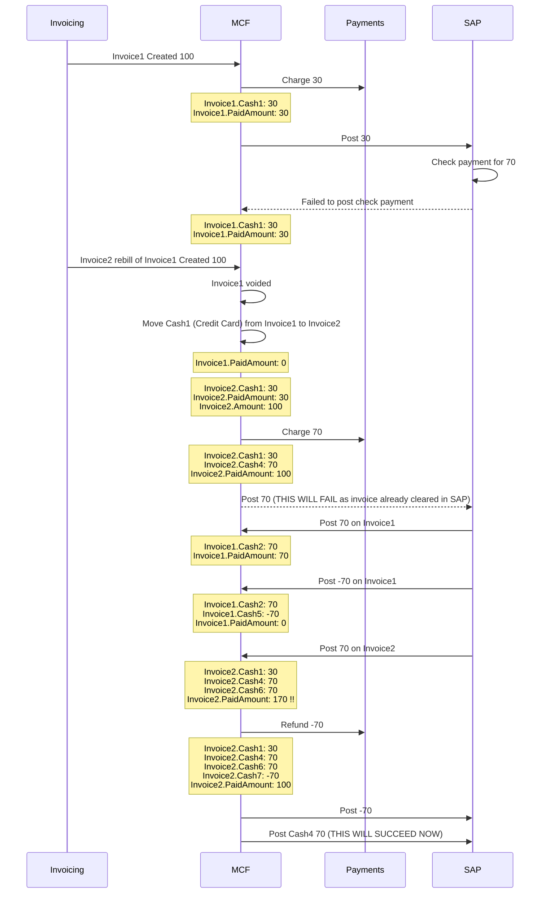
